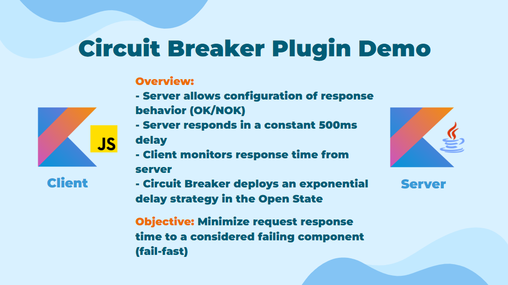

## Circuit Breaker Plugin Demo ⛔

This is a demo of the Circuit Breaker mechanism functionality 
available from the Kresil library as a plugin for Ktor Client.

### Running the demo ▶️

To run the demo, follow these steps:

1. Go to the root directory of the project:

```shell
cd ..
```

2. Start the server:

```shell
./gradlew :ktor-plugins-demo:circuitbreaker:jvm-server:run
```

3. Start the client:

```shell
./gradlew :ktor-plugins-demo:circuitbreaker:js-client:browserDevelopmentRun
```

4. A browser window will open with the demo.

> [!IMPORTANT]
> Ensure that the client is started only after the server is running, as it will occupy the localhost port 8080 if started first. This happens because the client also runs a server to serve the frontend.

### Description 📝



### Video 🎥

https://github.com/user-attachments/assets/8e2d66a5-080d-4735-aa8a-94985358f600
