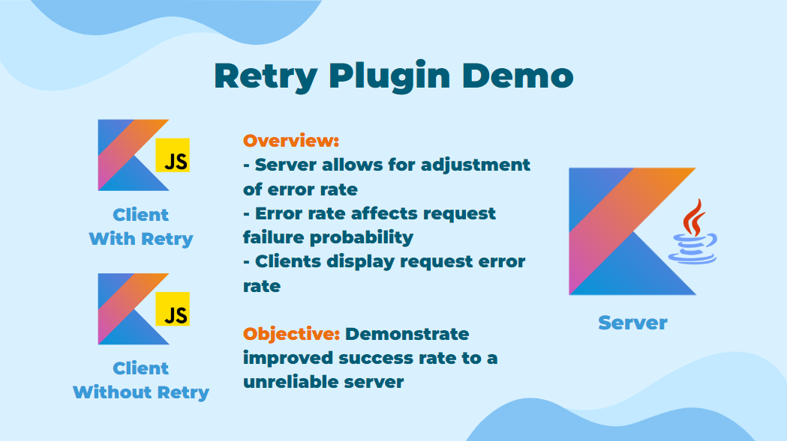

## Retry Plugin Demo 🔁

This is a demo of the Retry mechanism functionality 
available from the Kresil library as a plugin for Ktor Client.

### Running the demo ▶️

To run the demo, follow these steps:

1. Go to the root directory of the project:

```shell
cd ..
```

2. Start the server:

```shell
./gradlew :ktor-plugins-demo:retry:jvm-server:run
```

3. Start the client:

```shell
./gradlew :ktor-plugins-demo:retry:js-client:browserDevelopmentRun
```

4. A browser window will open with the demo.

> [!IMPORTANT]
> Make sure the client is only started after the server is running,
> as it will steal the localhost port `8080` if started first. This is because the client also runs a server to serve
> the frontend.

### Description 📝



### Video 🎥

- TODO(use embedded video)
